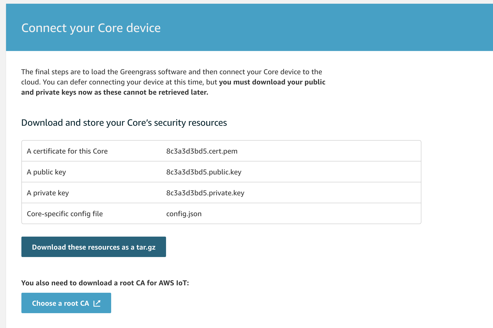

[1]: https://www.dropbox.com/sh/agx15xqa4kw8kwb/AAAELJxQZjbPbZTgWzb74xiza?dl=0
[2]: https://www.youtube.com/watch?v=6CxdrmHIIMo

# Greengrass Core for WAGO PFC200 G2 and TP600

Greengrass core images and examples for WAGO TP600 and PFC200 G2 controllers

[Find the firmware image files here][1]

To update the firmware on the controllers, please follow the steps highlited in this video.

[YouTube: How to Update the Firmware on PFC + TP600][2]

To use this:

1. Build the Group and Core by following the setup steps in the AWS IoT Core >> Greengrass >> Groups.  When available, download the tar.gz file that includes the credentials and config file

2. Copy the downloaded pacjkage to the controller using FTP or scp.  Untar this file to the greengrass directory
    
    `tar -xzvf /<identifier>.tar.gz -C /greengrass`

3. Download a current rootCA certificate from AWS servers
    
    `cd /greengrass/certs`
    `wget -O root.ca.pem https://www.amazontrust.com/repository/AmazonRootCA1.pem`

4. Start the greengrass service with the following commands
    
    `cd /greengrass/ggc/core`
    `sudo ./greengrassd start`
