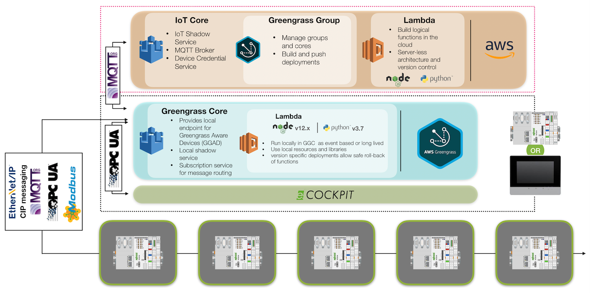
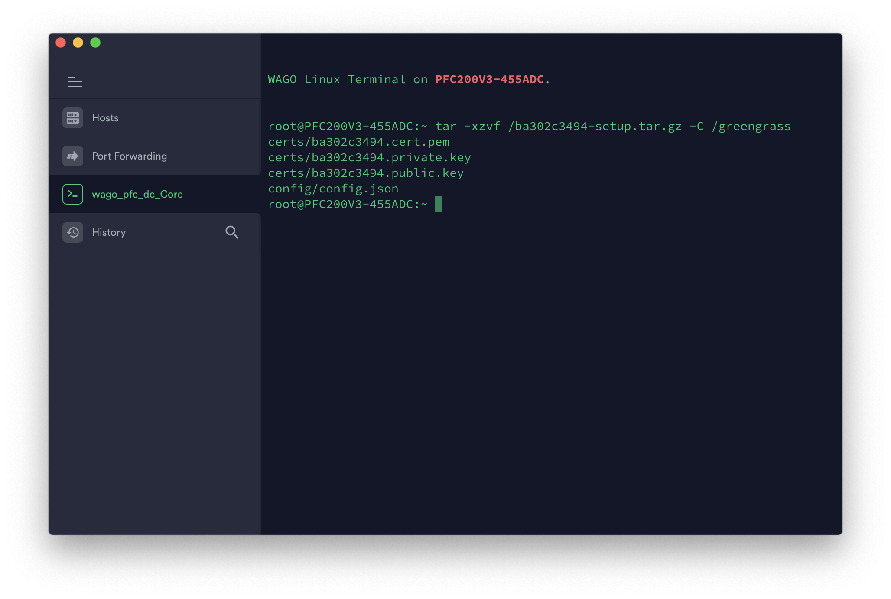

[1]: https://www.dropbox.com/s/74ehmq95xb67gam/WAGO_GGC.img?dl=0

# GreengrassCore
Greengrass core images and examples for WAGO TP600 and PFC200 G2 controllers

[Find the image file here][1]

To use this:

1. Build the Group and Core by following the setup steps in the AWS IoT Core >> Greengrass >> Groups

2. Use "Easy Creation" to build the development package and credentials

3. Download the tar.gz file that includes the credentials and config file

4. Copy the <certificate>.tar.gz file to the controllers / directory.  Extract and distribute to /greengrass
    bash
    tar -xzvf <identifier>.tar.gz -C /greengrass
